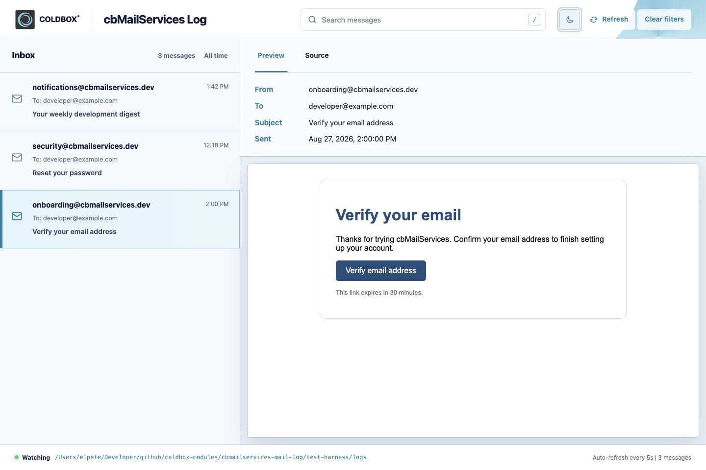
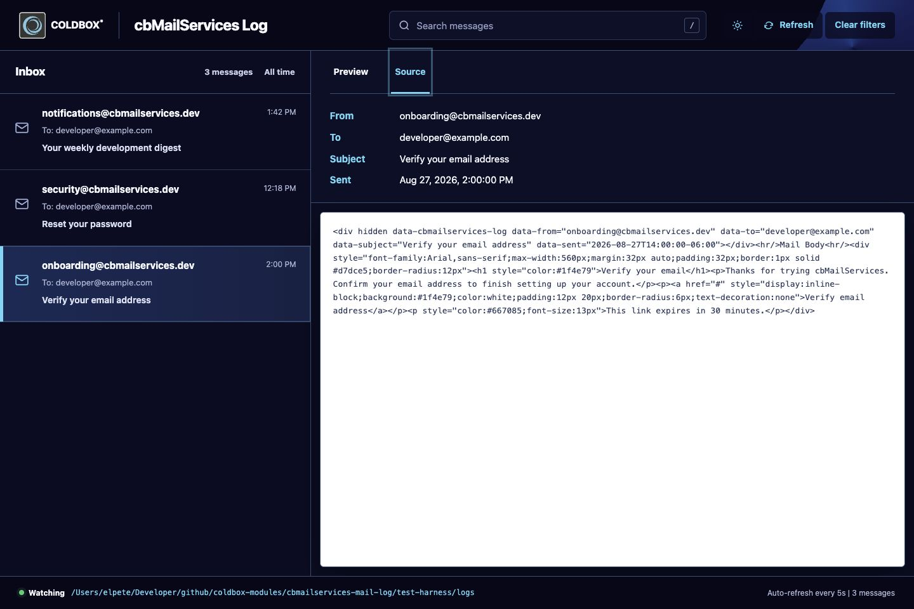

# 📬 Development Mail Viewer

Stop digging through log folders to see what your app just emailed. Since `2.12.0` the module ships with a local, development-only **inbox** for any mailer that uses the [File protocol](../protocols/file.md). Send mail, open `/cbmailservices/log`, and see it rendered exactly as a recipient would.











## ✨ Features

* **Inbox view** of every message with sender, recipient, subject and time.
* **Preview tab** that renders the HTML body, and a **Source tab** with the raw log file.
* **Instant search** across messages. Press `/` anywhere to jump to the search box and `Esc` to leave it.
* **Light and dark themes**. It follows your system preference and remembers your choice in `localStorage`.
* **Auto refresh** every 5 seconds, so new mail appears as it is sent. You can also refresh on demand.
* **Delete** a single message, a selection of messages, or everything.
* **Multiple mailers**. Messages from every File protocol mailer are merged into one inbox, sorted newest first.
* **Status bar** that shows which directories are being watched and the message count.
* **Responsive** layout that collapses into a list and detail view on small screens.

## 🚀 Getting Started

The viewer needs only two things: a `File` mailer, and the `development` ColdBox environment.



### Register a File mailer

```javascript
// config/ColdBox.cfc or config/ColdBox.bx
moduleSettings = {
    cbmailservices : {
        defaultProtocol : "files",
        mailers         : {
            "files" : {
                class      : "File",
                properties : { filePath : "/logs/mail" }
            }
        }
    }
};
```



### Make sure you are in `development`

ColdBox determines the environment with its [environment detection](https://coldbox.ortusbooks.com/getting-started/configuration/coldbox.cfc/configuration-directives/environments). Map your local hosts to a `development` environment:

```javascript
// config/ColdBox.cfc
function configure(){
    coldbox = { /* ... */ };
    environments = { development : "localhost,127\.0\.0\.1" };
}
```



### Send some mail

```javascript
newMail(
    to      : "developer@example.com",
    from    : "onboarding@myapp.dev",
    subject : "Verify your email address",
    type    : "html"
)
.setBody( "<h1>Verify your email</h1><p>Thanks for signing up.</p>" )
.send();
```



### Open the viewer

Visit `/cbmailservices/log` in your browser. For example: `http://localhost:8500/cbmailservices/log`.




Sending to a mailer other than a `File` mailer will not show up in the viewer. If you use multiple mailers, use a `File` mailer in development and your real one in production via [environment-specific settings](https://coldbox.ortusbooks.com/getting-started/configuration/coldbox.cfc/configuration-directives/environments).


## 🔒 Development Only

The viewer is **never available in production**. It is protected twice:

1. The module only registers its routes inside its `development()` convention, which ColdBox only runs in the `development` environment.
2. Every handler action re-checks that the `environment` setting is `development` and answers with a `404` otherwise.


Do not override your environment detection to force `development` on a public server. The viewer can read and delete any message stored by your File mailers.


## 🧠 How It Works

The [File protocol](../protocols/file.md) writes each email as an `.html` file and stamps it with a hidden element carrying the metadata:

```html
<div hidden data-cbmailservices-log
     data-from="onboarding@myapp.dev"
     data-to="developer@example.com"
     data-subject="Verify your email address"
     data-sent="2026-08-27T14:00:00-06:00"></div>
```

The viewer discovers every registered File mailer, lists the `*.html` files in its `filePath` and reads those attributes to build the inbox. Each message gets a stable id, which is a SHA-256 hash of the mailer name and file name. Clients never send file paths, so the endpoints can only touch files inside your configured mail directories.


Logs written by older versions of the module (before `2.12.0`) do not have the metadata element. The viewer falls back to parsing the dump output and uses the file's modified date for the sent time.


## 🔌 Endpoints

The module uses the `cbmailservices` entry point. All responses are JSON unless noted. Outside of `development` every endpoint returns `404`.

| Method | Route | Description |
| ------ | ----- | ----------- |
| `GET` | `/cbmailservices/log` | The viewer UI (HTML, no layout) |
| `GET` | `/cbmailservices/log/messages` | Lists `sources`, `messages` (newest first) and `refreshedAt` |
| `GET` | `/cbmailservices/log/message/:id` | A single message with `source` (raw file), `preview` (body) and `path` |
| `DELETE` | `/cbmailservices/log/message/:id` | Delete one message. Returns `{ deleted : [ id ], count : 1 }` or `404` |
| `DELETE` | `/cbmailservices/log/messages` | Bulk delete, see below |

Bulk delete accepts a JSON body with either a list of ids or the `all` flag. An empty request returns a `400`.

```bash
# Delete specific messages
curl -X DELETE http://localhost:8500/cbmailservices/log/messages \
  -H "Content-Type: application/json" \
  -d '{ "ids": [ "5f2c...", "a91b..." ] }'

# Delete everything in every File mailer
curl -X DELETE http://localhost:8500/cbmailservices/log/messages \
  -H "Content-Type: application/json" \
  -d '{ "all": true }'
```

A message summary looks like this:

```json
{
  "id"       : "5f2c...",
  "mailer"   : "files",
  "fileName" : "mail.08-27-2026.14-00-00-000.html",
  "from"     : "onboarding@myapp.dev",
  "to"       : "developer@example.com",
  "subject"  : "Verify your email address",
  "sent"     : "2026-08-27T14:00:00-06:00",
  "size"     : 1482
}
```

## 🧰 Troubleshooting

| Symptom | Fix |
| ------- | --- |
| `404 Not found` | Your ColdBox `environment` is not `development`. Check your `environments` detection. |
| Empty inbox | You have no mailer with `class : "File"`, the mail was sent with another mailer, or the `filePath` folder is empty. The status bar shows what is being watched. |
| Emails sent but nothing new | Confirm the mail was sent with `mailer : "files"` or that your `defaultProtocol` points to the File mailer. |
| Wrong folder | `autoExpand` defaults to `true` and calls `expandPath()` on `filePath`. Set `autoExpand : false` for an absolute path. |


[file.md](../protocols/file.md)



[configuration.md](configuration.md)

